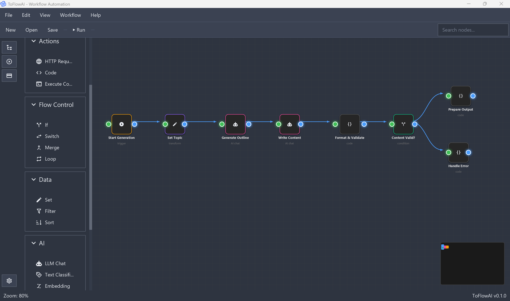
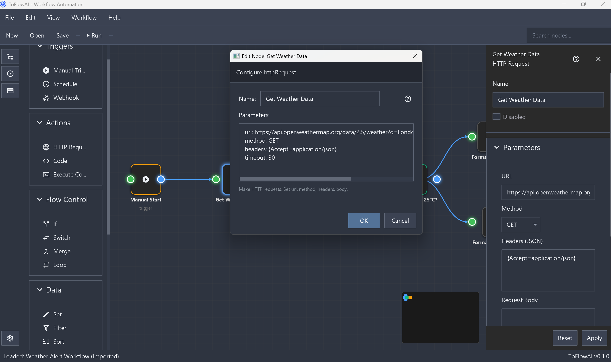
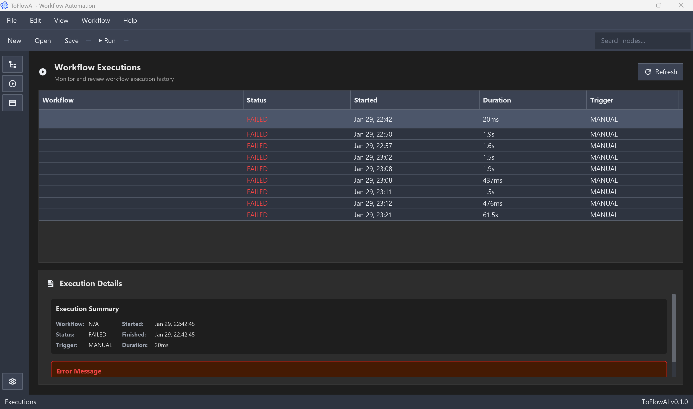
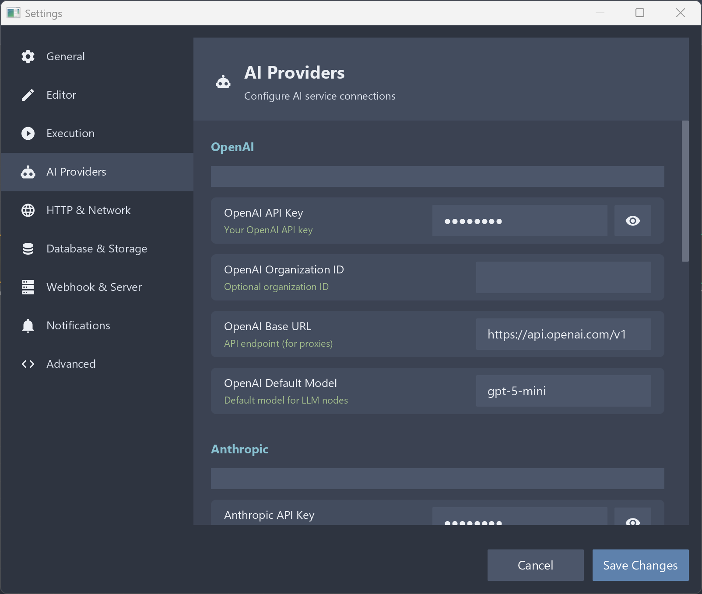
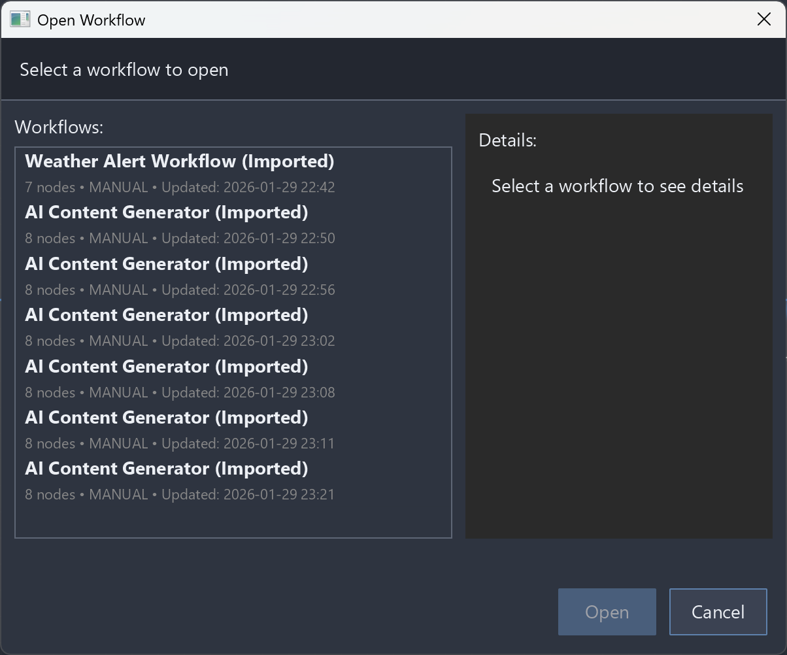

# ToFlowAI

<p align="center">
  
</p>

<p align="center">
  <strong>Visual Workflow Automation for Everyone</strong>
</p>

<p align="center">
  <a href="#features">Features</a> •
  <a href="#todos--known-limitations">TODOs & Limitations</a> •
  <a href="#screenshots">Screenshots</a> •
  <a href="#getting-started">Getting Started</a> •
  <a href="#documentation">Documentation</a> •
  <a href="#contributing">Contributing</a>
</p>

<p align="center">
  
  
  
  
  
  
</p>

---

## 🚀 What is ToFlowAI?

ToFlowAI is a **visual workflow automation application** similar to [n8n](https://n8n.io), [Zapier](https://zapier.com), or [Make.com](https://make.com). It's also inspired by [Sim.ai](https://sim.ai) but designed as a **simpler, local-first alternative** that runs entirely on your machine—no cloud deployment, no infrastructure hassles. Just **install and use**.

### 🤖 Understanding Workflows & Agentic AI

**What are Workflows?**
Workflows are automated sequences of tasks that transform data and perform actions. Instead of manually executing repetitive processes, you create a visual "flow" where each step (called a "node") handles a specific function. Data flows from one node to the next, creating powerful automation chains.

**Why Visual Workflow Automation?**
- **No-Code/Low-Code**: Build complex automations without programming skills
- **Visual Debugging**: See exactly how data flows through your processes
- **Modular Design**: Reuse and combine building blocks for different scenarios
- **Real-time Feedback**: Watch your workflows execute step-by-step

**Agentic AI Connection:**
ToFlowAI helps you understand and build **agentic AI systems** - AI that can autonomously plan, execute, and adapt. By creating workflows, you learn:
- How AI agents break down complex tasks into steps
- How different tools/APIs can be orchestrated together
- How decision-making and conditional logic work in automation
- How to design systems that can handle errors and adapt

### 🆚 How ToFlowAI Compares

| Feature | ToFlowAI | n8n | Zapier | Sim.ai |
|---------|----------|-----|--------|--------|
| **Deployment** | Local Desktop | Cloud/Self-hosted | Cloud | Cloud |
| **Cost** | Free (MIT) | Free tier + Paid | Freemium | Paid |
| **Privacy** | 100% Local | Variable | Cloud-stored | Cloud-stored |
| **Customization** | Full source access | Limited | Limited | Limited |
| **Learning Tool** | Excellent for AI education | Production focus | Business focus | AI focus |
| **Setup Complexity** | Download & run | Account setup | Account setup | Account setup |

**ToFlowAI's Unique Value:**
- **Educational Focus**: Perfect for learning agentic AI concepts
- **Local-First**: Your data never leaves your machine
- **Open Source**: Study, modify, and contribute to the codebase
- **Java-Based**: Learn enterprise-grade development practices
- **Spring Boot Integration**: Understand full-stack application architecture

### 🎯 Perfect For:
- **AI Enthusiasts** learning about agentic systems
- **Developers** studying workflow automation patterns
- **Privacy-Conscious Users** who want local control
- **Educators** teaching automation and AI concepts
- **Experimenters** building custom automation solutions

Create automated workflows by connecting "nodes" (building blocks) together visually, with your data staying completely local.

Built with **Java 25**, **Spring Boot 4.0.1**, and **JavaFX 21**, ToFlowAI runs as a native desktop application with a modern dark theme powered by [AtlantaFX](https://github.com/mkpaz/atlantafx).

---

## ✨ Features

### 🎨 Visual Workflow Designer
- Drag-and-drop node placement
- Visual connection system with smooth curves
- Real-time execution preview
- Pan, zoom, and grid snapping

### 🔧 Node Types
| Category | Nodes |
|----------|-------|
| **Triggers** | Manual Trigger, Schedule Trigger, Webhook |
| **Actions** | HTTP Request, Code (JavaScript), Set Data |
| **Flow Control** | IF Conditional, Loop, Merge |
| **AI/LLM** | LLM Chat (OpenAI, Anthropic, etc.) |

### ⚡ Execution Engine
- Real-time step-by-step execution
- Expression interpolation (`{{ variable }}` syntax)
- Error handling with retry and fallback patterns
- Execution history and debugging

### 🔐 Settings & Configuration
- Secure credential storage (AES-256 encryption)
- Import/Export settings as JSON
- Per-workflow and global settings
- API key management for LLM providers

### 💾 Data Management
- H2 embedded database
- Flyway database migrations
- Workflow import/export (JSON)
- Sample workflows included

---

## 🚧 TODOs & Known Limitations

### ⚠️ Current Limitations
These features are **not yet implemented** and should not be expected:

- **Cloud Deployment**: No web-based version or cloud hosting
- **Multi-User Collaboration**: No shared workspaces or team features
- **Advanced Scheduling**: Limited cron-like scheduling (basic only)
- **Plugin System**: No third-party plugin support yet
- **Real-time Collaboration**: No live editing with others
- **Version Control**: No built-in workflow versioning system
- **API Endpoints**: No REST API for external integrations
- **Mobile Apps**: No iOS/Android companion apps

### 🔄 Planned Improvements

#### **Short Term**
- [ ] Enhanced error handling and recovery
- [ ] Workflow execution statistics and analytics
- [ ] Improved node property validation
- [ ] Better drag-and-drop UX refinements
- [ ] Keyboard shortcuts and accessibility improvements
- [ ] Dark/light theme toggle
- [ ] Workflow templates library

#### **Medium Term**
- [ ] Advanced workflow scheduling (cron expressions)
- [ ] Node execution timeout controls
- [ ] Workflow dependency management
- [ ] Bulk operations on multiple workflows
- [ ] Enhanced logging and debugging tools
- [ ] Performance optimizations for large workflows

#### **Long Term**
- [ ] Plugin architecture for custom nodes
- [ ] Cloud sync and backup (optional)
- [ ] Team collaboration features
- [ ] Advanced workflow branching and conditions
- [ ] Integration with external services (webhooks, APIs)
- [ ] Mobile companion app
- [ ] Workflow marketplace/community sharing

### 🛠️ Development Priorities
- **Stability First**: Bug fixes and performance improvements
- **User Experience**: Polish the core workflow creation experience
- **Extensibility**: Design plugin system for community contributions
- **Documentation**: Comprehensive user and developer guides

### 🤝 Contributing
Want to help with any of these? Check our [Contributing Guide](CONTRIBUTING.md) and join the development!

---

## 📸 Screenshots

### Main Application Window
<p align="center">
  
  <br />
  <em>Main application interface with workflow canvas and node palette</em>
</p>

### Visual Node Editing
<p align="center">
  
  <br />
  <em>Drag-and-drop node editing with property panels</em>
</p>

### Real-time Execution
<p align="center">
  
  <br />
  <em>Live execution monitoring with step-by-step progress</em>
</p>

### AI Settings Configuration
<p align="center">
  
  <br />
  <em>Configure AI providers and API keys securely</em>
</p>

### Workflow Import
<p align="center">
  
  <br />
  <em>Import workflows from JSON files</em>
</p>

---

## 🏁 Getting Started

### Prerequisites

- **Java 25** (Microsoft OpenJDK recommended)
  ```powershell
  # Windows - Download from:
  # https://learn.microsoft.com/en-us/java/openjdk/download
  ```
- **Git** for cloning the repository

### Installation

#### Option 1: Download Pre-built Installer (Recommended)

1. **Download the MSI installer** from [Releases](https://github.com/tolgayilmaz86/ToFlowAI/releases)
2. **Run the installer** - it includes everything needed
3. **Launch ToFlowAI** from Start Menu or desktop shortcut

#### Option 2: Build from Source

1. **Clone the repository**
   ```bash
   git clone https://github.com/tolgayilmaz86/ToFlowAI.git
   cd ToFlowAI
   ```

2. **Set JAVA_HOME** (if not already set)
   ```powershell
   # Windows PowerShell
   $env:JAVA_HOME = "C:\Program Files\Microsoft\jdk-25.0.0.36-hotspot"
   ```

3. **Build and run**
   ```bash
   # Build the project
   ./gradlew build
   
   # Run the application
   ./gradlew :app:bootRun
   ```

#### Option 3: Build Standalone Installer

```powershell
# Build MSI installer (includes embedded Java runtime)
.\tools\build-installer.ps1

# Or build portable version (no installation required)
.\tools\build-installer.ps1 -Portable
```

### First Run

1. The application will start with an empty canvas
2. **Create a new workflow**: File → New Workflow
3. **Add nodes**: Drag from the Node Palette on the left
4. **Connect nodes**: Drag from output port to input port
5. **Execute**: Click the ▶️ Run button

---

## 📁 Project Structure

```
ToFlowAI/
├── app/                    # Main Spring Boot application
│   └── src/main/java/
│       └── io.toflowai.app/
│           ├── config/     # Spring configuration
│           ├── controller/ # REST API endpoints
│           ├── service/    # Business logic
│           └── repository/ # Data access
│
├── ui/                     # JavaFX UI module
│   └── src/main/java/
│       └── io.toflowai.ui/
│           ├── canvas/     # Workflow canvas components
│           ├── nodes/      # Node UI implementations
│           ├── dialogs/    # Settings, properties dialogs
│           └── theme/      # AtlantaFX theming
│
├── common/                 # Shared DTOs and utilities
│   └── src/main/java/
│       └── io.toflowai.common/
│           ├── dto/        # Data Transfer Objects
│           ├── enums/      # NodeType, etc.
│           └── util/       # Shared utilities
│
├── samples/                # Sample workflow JSON files
│   ├── 01-weather-alert-workflow.json
│   ├── 02-ai-content-generator.json
│   ├── 03-data-processing-pipeline.json
│   ├── 04-multi-api-integration.json
│   ├── 05-error-handling-demo.json
│   └── README.md
│
├── docs/                   # Documentation
│   └── ARCHITECTURE.md     # Comprehensive architecture guide
│
├── tools/                  # Build and packaging tools
│   ├── build-installer.ps1 # Windows installer builder
│   └── wix314/             # Auto-downloaded WiX Toolset (created on first MSI build)
├── .github/workflows/      # CI/CD pipelines
│   └── build.yml           # Build, test, analyze, package
├── build.gradle            # Root build configuration
├── sonar-project.properties # SonarQube configuration
└── settings.gradle         # Multi-module settings
```

---

## 🛠️ Technology Stack

| Layer | Technology | Version |
|-------|------------|---------|
| **Language** | Java | 25 |
| **Backend** | Spring Boot | 3.5.0 |
| **Frontend** | JavaFX | 21.0.5 |
| **UI Theme** | AtlantaFX (NordDark) | 2.0.1 |
| **Database** | H2 (embedded) | - |
| **Migrations** | Flyway | 10.20.1 |
| **Build** | Gradle | 9.2.0 |
| **JavaScript** | GraalVM JS | 24.1.1 |
| **Packaging** | jpackage, jlink | - |
| **Installer** | WiX Toolset | 3.14 (auto-downloaded) |
| **Code Quality** | SonarQube | 6.0.1 |
| **Testing** | JUnit 5, TestFX, ArchUnit | - |

---

## 📦 Building Installers

ToFlowAI can be packaged as a standalone installer with an embedded GraalVM runtime. Users don't need Java installed.

### Windows MSI Installer

```powershell
# Build MSI installer with embedded runtime (requires WiX Toolset - auto-downloaded)
.\tools\build-installer.ps1

# Build with specific version
.\tools\build-installer.ps1 -Version "1.0.0"

# Skip clean step for faster rebuilds
.\tools\build-installer.ps1 -SkipClean
```

### Portable ZIP (No Installation Required)

```powershell
# Build portable app-image (no WiX required)
.\tools\build-installer.ps1 -Portable

# Skip GraalVM download if already present
.\tools\build-installer.ps1 -Portable -SkipDownload
```

### Build Outputs

| Type | File | Size | Description |
|------|------|------|-------------|
| **MSI Installer** | `ToFlowAI-{version}.msi` | ~160 MB | Windows installer with Start Menu shortcuts |
| **Portable ZIP** | `ToFlowAI/` directory | ~251 MB | Standalone executable, no installation needed |

### What's Included

- ✅ ToFlowAI application
- ✅ Embedded GraalVM runtime (~92 MB uncompressed)
- ✅ All dependencies bundled
- ✅ Windows Start Menu shortcuts (MSI only)
- ✅ No Java installation required
- ✅ Auto-downloads WiX Toolset for MSI builds

---

## 🔍 Code Quality & Analysis

### SonarQube Integration

ToFlowAI uses SonarQube for static code analysis, code coverage, and quality gates.

```bash
# Run local analysis (requires SonarQube server)
./gradlew sonar -Dsonar.host.url=http://localhost:9000 -Dsonar.token=YOUR_TOKEN

# With Docker
docker run -d --name sonarqube -p 9000:9000 sonarqube:community
# Wait for startup, create project, then run analysis
```

### Coverage Reports

```bash
# Generate JaCoCo coverage reports
./gradlew test jacocoTestReport

# Reports at: app/build/reports/jacoco/test/html/index.html
```

---

## 🔄 CI/CD Pipeline

ToFlowAI uses GitHub Actions for automated building, testing, and packaging:

- **Build & Test**: Runs on every push/PR
- **SonarQube Analysis**: Code quality and security scanning
- **Windows Installer**: Auto-builds MSI installer with embedded runtime
- **Artifact Storage**: Uploads installers to GitHub Releases

See: [`.github/workflows/build.yml`](.github/workflows/build.yml)

---

## 📖 Documentation

- **[Architecture Guide](docs/ARCHITECTURE.md)** - Comprehensive guide for developers
- **[Sample Workflows](samples/README.md)** - Ready-to-import workflow examples
- **[API Reference](docs/API.md)** - REST API documentation *(coming soon)*

---

## 🧪 Sample Workflows

ToFlowAI includes sample workflows to help you get started:

| Sample | Description | Features Demonstrated |
|--------|-------------|----------------------|
| **Weather Alert** | Monitor weather and send alerts | HTTP Request, Code, IF |
| **AI Content Generator** | Generate content with LLMs | LLM Chat, Chained calls |
| **Data Processing** | Batch process with filtering | Loop, Merge, Aggregation |
| **Multi-API Integration** | Combine multiple APIs + AI | HTTP Chain, LLM |
| **Error Handling** | Retry and fallback patterns | Error handling, Conditionals |

Import via: **File** → **Import Workflow** → Select from `samples/` directory

---

## 🔧 Configuration

### Environment Variables

| Variable | Description | Default |
|----------|-------------|---------|
| `OPENAI_API_KEY` | OpenAI API key for LLM nodes | - |
| `ANTHROPIC_API_KEY` | Anthropic API key | - |
| `APP_VERSION` | Application version | `0.1.0-SNAPSHOT` |

### Application Settings

Settings are managed via the **Settings** dialog (`Ctrl+,`) and stored securely in the H2 database with AES-256 encryption for sensitive values.

---

## 🤝 Contributing

Contributions are welcome! Please read our contributing guidelines before submitting a PR.

### Development Setup

1. Fork the repository
2. Create a feature branch: `git checkout -b feature/amazing-feature`
3. Make your changes
4. Run tests: `./gradlew test`
5. Commit: `git commit -m 'Add amazing feature'`
6. Push: `git push origin feature/amazing-feature`
7. Open a Pull Request

### Code Style

- Follow Java conventions (camelCase for methods, PascalCase for classes)
- Use `record` for immutable DTOs
- Add JavaDoc for public APIs
- Write unit tests for new features

---

## 📄 License

This project is licensed under the MIT License - see the [LICENSE](LICENSE) file for details.

---

## 🙏 Acknowledgments

- [n8n](https://n8n.io) - Inspiration for workflow automation concepts
- [Sim.ai](https://sim.ai) - Inspiration for local-first workflow design
- [AtlantaFX](https://github.com/mkpaz/atlantafx) - Beautiful JavaFX themes
- [Ikonli](https://kordamp.org/ikonli/) - Icon packs for JavaFX
- [GraalVM](https://www.graalvm.org/) - JavaScript execution engine
- [WiX Toolset](https://wixtoolset.org/) - Windows installer creation

---

<p align="center">
  Made with ❤️ by the Tolga Yilmaz
</p>
