# ToFlowAI Architecture Guide

> **A Comprehensive Guide for Junior Developers**  
> **Version:** 1.4  
> **Last Updated:** January 29, 2026

---

## Table of Contents

1. [Introduction](#1-introduction)
2. [For .NET Developers](#2-for-net-developers)
3. [What is Workflow Automation?](#3-what-is-workflow-automation)
4. [Project Overview](#4-project-overview)
5. [Technology Stack](#5-technology-stack)
6. [Module Architecture](#6-module-architecture)
7. [Core Concepts](#7-core-concepts)
8. [UML Diagrams (Mermaid)](#8-uml-diagrams)
9. [Backend Architecture (Spring Boot)](#9-backend-architecture-spring-boot)
10. [Frontend Architecture (JavaFX)](#10-frontend-architecture-javafx)
11. [Data Flow](#11-data-flow)
12. [Sample Workflows](#12-sample-workflows)
13. [Adding New Features](#13-adding-new-features)
14. [Recent Changes & Integrations](#14-recent-changes--integrations)
15. [Best Practices](#15-best-practices)
16. [Troubleshooting](#16-troubleshooting)
17. [Glossary](#17-glossary)
18. [Quick Reference Card](#18-quick-reference-card)

---

## 1. Introduction

### Welcome, Developer! 👋

ToFlowAI is a **visual workflow automation application** similar to n8n, Zapier, or Make.com. It's also inspired by [Sim.ai](https://sim.ai) but designed as a **simpler, local-first alternative** that runs entirely on your machine—no cloud deployment, no infrastructure hassles. Just **install and use**.

Create automated workflows by connecting "nodes" (building blocks) together visually, with your data staying completely local.

**This guide will help you:**
- Understand how workflow automation works
- Navigate the codebase confidently
- Add new features and node types
- Follow best practices

---

## 2. For .NET Developers

If you're coming from C#/.NET, here's a quick translation guide:

### Terminology Mapping

| .NET / C# | Java / Spring | Notes |
|-----------|---------------|-------|
| `class MyService` | `@Service class MyService` | Spring annotation marks it as injectable |
| `IMyService` (interface) | `MyServiceInterface` | Convention: `*Interface` suffix |
| `[ApiController]` | `@RestController` | REST API controller |
| `DbContext` | `JpaRepository<Entity, ID>` | Database access layer |
| `appsettings.json` | `application.properties` | Configuration file |
| `Program.cs` / `Startup.cs` | `@SpringBootApplication` | App entry point |
| `IServiceCollection.AddScoped()` | `@Service` / `@Component` | DI registration |
| `IConfiguration` | `@Value` / `Environment` | Config injection |
| `async/await Task<T>` | `CompletableFuture<T>` | Async operations |
| NuGet | Maven/Gradle | Package manager |
| `.csproj` | `build.gradle` | Build configuration |
| `record` (C# 9+) | `record` (Java 16+) | Immutable data class |
| `var` | `var` (Java 10+) | Type inference |
| LINQ `.Where().Select()` | Streams `.filter().map()` | Collection operations |

### Code Comparison

```csharp
// C# / .NET
public interface IWorkflowService {
    Task<List<WorkflowDto>> GetAllAsync();
    Task<WorkflowDto?> GetByIdAsync(long id);
    Task<WorkflowDto> SaveAsync(WorkflowDto workflow);
}

[Service] // In .NET this would be registered in DI container
public class WorkflowService : IWorkflowService {
    private readonly IWorkflowRepository _repository;
    
    public WorkflowService(IWorkflowRepository repository) {
        _repository = repository;
    }
}
```

```java
// Java / Spring (equivalent)
public interface WorkflowServiceInterface {
    List<WorkflowDTO> findAll();
    Optional<WorkflowDTO> findById(Long id);
    WorkflowDTO save(WorkflowDTO workflow);
}

@Service  // Automatically registered in Spring DI container
public class WorkflowService implements WorkflowServiceInterface {
    private final WorkflowRepository repository;
    
    public WorkflowService(WorkflowRepository repository) {  // Constructor injection
        this.repository = repository;
    }
}
```

### Key Differences to Remember

| Aspect | .NET | Spring/Java |
|--------|------|-------------|
| **Null handling** | `nullable?`, `??` | `Optional<T>`, `.orElse()` |
| **DI Lifetime** | `Scoped`, `Singleton`, `Transient` | Default is Singleton, use `@Scope` for others |
| **Async** | `async/await` everywhere | Virtual threads (Java 21+) - blocking is OK! |
| **Properties** | `get; set;` | Explicit getters/setters or `record` |
| **Naming** | PascalCase methods | camelCase methods |

---

## 3. What is Workflow Automation?

### 3.1 The Big Picture

Imagine you want to:
1. Monitor a folder for new files
2. When a file arrives, extract text from it
3. Send the text to an AI for analysis
4. Email the results to your team

**Without automation:** You do this manually, every time.  
**With ToFlowAI:** You build it once, it runs forever.

### 3.2 Core Terminology

| Term | Definition | Example |
|------|------------|---------|
| **Workflow** | A complete automation blueprint | "Process customer emails" |
| **Node** | A single action/step in the workflow | "Send HTTP request", "Run code" |
| **Connection** | Link between nodes showing data flow | Output of node A → Input of node B |
| **Trigger** | Special node that starts the workflow | "Every Monday at 9 AM", "On webhook" |
| **Executor** | Backend code that runs a node | `HttpRequestExecutor`, `CodeExecutor` |
| **Execution** | One complete run of a workflow | Started at 10:30, took 5 seconds |

### 3.3 Sample Workflow (Mermaid)

```mermaid
flowchart LR
    A[🔔 Webhook Trigger] --> B[🌐 HTTP Request]
    B --> C[💻 Code Node]
    C --> D[📧 Email Node]
    
    subgraph "Data Flow"
        A -- "webhook_data" --> B
        B -- "api_response" --> C
        C -- "formatted_data" --> D
    end
```



### 3.4 Comparison with Other Tools

| Feature | n8n | Zapier | ToFlowAI |
|---------|-----|--------|----------|
| Visual Editor | ✅ | ✅ | ✅ |
| Self-Hosted | ✅ | ❌ | ✅ |
| Open Source | ✅ | ❌ | ✅ |
| Desktop App | ❌ | ❌ | ✅ |
| AI Nodes | ✅ | ✅ | ✅ |
| Code Nodes | ✅ | Limited | ✅ |

---

## 4. Project Overview

### 4.1 High-Level Architecture (Mermaid)

```mermaid
graph TB
    subgraph UI["🖥️ UI Module (JavaFX)"]
        Canvas[WorkflowCanvas]
        Dialogs[Settings Dialog]
        Editors[Property Editors]
    end
    
    subgraph Common["📦 Common Module (Shared)"]
        DTOs[DTOs]
        Enums[Enums]
        Interfaces[Service Interfaces]
        Domain[Domain Objects]
    end
    
    subgraph App["⚙️ App Module (Spring Boot)"]
        Services[Services]
        Executors[Node Executors]
        Repos[Repositories]
    end
    
    subgraph DB["💾 Database"]
        H2[(H2 Database)]
    end
    
    UI --> Common
    App --> Common
    UI -.->|"uses interfaces"| App
    App --> DB
```



### 4.2 Directory Structure

```
ToFlowAI/
├── 📁 app/                          # Spring Boot backend
│   └── src/main/java/io/toflowai/app/
│       ├── 📁 api/                  # REST controllers (future)
│       ├── 📁 config/               # Spring configuration
│       ├── 📁 database/             # JPA entities & repositories
│       │   ├── model/               # Database entities
│       │   └── repository/          # Spring Data JPA repos
│       ├── 📁 entity/               # Additional entities
│       ├── 📁 executor/             # 🌟 NODE EXECUTORS (key!)
│       │   ├── HttpRequestExecutor.java
│       │   ├── CodeExecutor.java
│       │   ├── LlmChatExecutor.java
│       │   └── ... (22+ executors)
│       └── 📁 service/              # Business logic services
│           ├── ExecutionService.java
│           ├── WorkflowService.java
│           ├── SettingsService.java  # NEW: Settings management
│           ├── NodeExecutor.java    # Interface
│           └── NodeExecutorRegistry.java
│
├── 📁 common/                       # Shared code (no dependencies)
│   └── src/main/java/io/toflowai/common/
│       ├── 📁 domain/               # Core domain objects
│       │   ├── Node.java            # Node record
│       │   ├── Connection.java      # Connection record
│       │   └── Execution.java       # Execution record
│       ├── 📁 dto/                  # Data Transfer Objects
│       │   ├── WorkflowDTO.java
│       │   ├── ExecutionDTO.java
│       │   └── SettingDTO.java
│       ├── 📁 enums/                # Enumerations
│       │   ├── ExecutionStatus.java
│       │   ├── SettingCategory.java
│       │   └── SettingType.java
│       ├── 📁 expression/           # Expression evaluation
│       └── 📁 service/              # Service interfaces
│           ├── WorkflowServiceInterface.java
│           ├── ExecutionServiceInterface.java
│           └── SettingsServiceInterface.java
│
├── 📁 ui/                           # JavaFX desktop UI
│   └── src/main/java/io/toflowai/ui/
│       ├── 📁 canvas/               # Workflow editor canvas
│       │   ├── WorkflowCanvas.java  # Main canvas component
│       │   ├── NodeView.java        # Visual node representation
│       │   ├── ConnectionLine.java  # Visual connection
│       │   └── NodePropertiesPanel.java
│       ├── 📁 console/              # Execution console
│       ├── 📁 controller/           # FXML controllers
│       ├── 📁 dialog/               # Dialog windows
│       │   ├── SettingsDialog.java
│       │   └── CredentialManagerDialog.java
│       └── 📁 editor/               # Code editors
│
├── 📁 docs/                         # Documentation
│   ├── DEVELOPMENT_PLAN.md
│   └── ARCHITECTURE.md              # This file!
│
├── 📄 build.gradle                  # Root build configuration
├── 📄 settings.gradle               # Multi-module settings
└── 📄 gradlew.bat                   # Gradle wrapper (Windows)
```

### 3.3 Why This Structure?

| Module | Responsibility | Depends On |
|--------|----------------|------------|
| **common** | Shared types (DTOs, enums, interfaces) | Nothing |
| **app** | Business logic, database, execution | common |
| **ui** | User interface, visual editor | common |

**Benefits:**
- ✅ Clear separation of concerns
- ✅ UI can be replaced without touching business logic
- ✅ Common types ensure consistency
- ✅ Each module can be tested independently

---

## 5. Technology Stack

### 5.1 Overview


| Layer | Technology | Purpose |
|-------|------------|---------|
| **Frontend** | JavaFX 21.0.5 | Desktop GUI framework |
| **Theme** | AtlantaFX (Nord Dark) | Modern UI styling |
| **Icons** | Ikonli (Material Design) | Icon library |
| **Backend** | Java 25 + Spring Boot 3.5.0 | Application framework with virtual threads |
| **Database** | H2 (embedded) | SQL database |
| **Migrations** | Flyway | Schema version control |
| **Build** | Gradle 9.2.0 | Build automation |

### 5.2 Why These Technologies?

#### Java 25 with Virtual Threads

```java
// OLD WAY: Platform threads (expensive, limited)
ExecutorService executor = Executors.newFixedThreadPool(10);

// NEW WAY: Virtual threads (cheap, unlimited)
ExecutorService executor = Executors.newVirtualThreadPerTaskExecutor();
```

**Virtual Threads Benefits:**
- Each node execution can have its own thread
- No thread pool exhaustion
- Blocking I/O doesn't block other work
- Perfect for workflow automation (many concurrent operations)

#### Spring Boot 3.5.0

Spring Boot provides:
- **Dependency Injection** - Components are wired automatically
- **Transaction Management** - Database operations are atomic
- **Configuration** - `application.properties` for settings
- **Testing** - Built-in test support

```java
// Spring creates and wires this automatically
@Service
public class ExecutionService {
    private final WorkflowService workflowService;  // Injected!
    private final NodeExecutorRegistry registry;    // Injected!
    
    public ExecutionService(WorkflowService ws, NodeExecutorRegistry nr) {
        this.workflowService = ws;
        this.registry = nr;
    }
}
```

#### JavaFX with AtlantaFX

```java
// Modern dark theme UI
Application.setUserAgentStylesheet(new NordDark().getUserAgentStylesheet());
```

**Why JavaFX?**
- Native desktop performance
- Rich visual components
- Canvas for workflow editor
- Cross-platform (Windows, Mac, Linux)

### 4.3 Running the Application

```bash
# Set Java 25
$env:JAVA_HOME = "C:\Program Files\Microsoft\jdk-25.0.0.36-hotspot"

# Build the project
.\gradlew.bat clean build -x test

# Run the application
.\gradlew.bat :app:bootRun
```

---

## 6. Module Architecture

### 6.1 Module Dependency Diagram


**Module Dependency Rules:**
| Rule | Description |
|------|-------------|
| **common** → nothing | Knows nothing about app or ui |
| **app** → common | Implements interfaces defined in common |
| **ui** → common | Uses interfaces, not implementations |
| **ui** ⟷ **app** | Connected via Spring's dependency injection |

### 6.2 Interface Pattern

The `common` module defines interfaces. The `app` module implements them. The `ui` module uses them.

```java
// In COMMON module - just the interface
public interface WorkflowServiceInterface {
    List<WorkflowDTO> findAll();
    Optional<WorkflowDTO> findById(Long id);
    WorkflowDTO save(WorkflowDTO workflow);
}

// In APP module - the implementation
@Service
public class WorkflowService implements WorkflowServiceInterface {
    private final WorkflowRepository repository;
    
    @Override
    public List<WorkflowDTO> findAll() {
        return repository.findAll().stream()
            .map(this::toDTO)
            .toList();
    }
    // ... more methods
}

// In UI module - uses the interface
public class WorkflowCanvas {
    private final WorkflowServiceInterface workflowService;  // Interface!
    
    public void saveWorkflow() {
        workflowService.save(this.workflow);
    }
}
```

**Why This Pattern?**
- UI doesn't depend on Spring
- We could swap `WorkflowService` for a mock in tests
- Clear contract between modules

---

## 7. Core Concepts

### 7.1 Node

A **Node** is a single step in a workflow.

```java
// In common/domain/Node.java
public record Node(
    String id,           // Unique ID (UUID)
    String type,         // "httpRequest", "code", "if", etc.
    String name,         // User's display name
    Position position,   // Canvas position (x, y)
    Map<String, Object> parameters,  // Configuration
    Long credentialId,   // Optional credential reference
    boolean disabled,    // Skip this node?
    String notes         // User's notes
) {
    public record Position(double x, double y) {}
}
```

**Example Node (HTTP Request):**
```json
{
    "id": "node_abc123",
    "type": "httpRequest",
    "name": "Call Weather API",
    "position": { "x": 300, "y": 200 },
    "parameters": {
        "url": "https://api.weather.com/v1/forecast",
        "method": "GET",
        "headers": {
            "Accept": "application/json"
        }
    },
    "credentialId": 42,
    "disabled": false
}
```

### 7.2 Connection

A **Connection** links two nodes together.

```java
// In common/domain/Connection.java
public record Connection(
    String id,              // Unique ID
    String sourceNodeId,    // Output from this node
    String targetNodeId,    // Input to this node
    String sourceHandle,    // Which output port ("main", "true", "false")
    String targetHandle     // Which input port ("main")
) {}
```

**Visual Representation:**

```mermaid
flowchart LR
    subgraph IF["IF Node"]
        TRUE[TRUE ●]
        FALSE[FALSE ●]
    end
    
    subgraph EMAIL["Email Node"]
        MAIN[● main]
    end
    
    TRUE --> MAIN
    
    style TRUE fill:#4caf50,stroke:#2e7d32
    style FALSE fill:#f44336,stroke:#c62828
```


```json
{
    "sourceNodeId": "if_node_1",
    "targetNodeId": "email_node_1", 
    "sourceHandle": "true",
    "targetHandle": "main"
}
```

### 7.3 Workflow

A **Workflow** is a collection of nodes and connections.

```java
// In common/dto/WorkflowDTO.java
public record WorkflowDTO(
    Long id,
    String name,
    String description,
    List<Node> nodes,           // All nodes
    List<Connection> connections, // All connections
    Map<String, Object> settings, // Workflow settings
    boolean active,              // Is it runnable?
    Instant createdAt,
    Instant updatedAt
) {
    // Helper method
    public List<Node> getTriggerNodes() {
        return nodes.stream()
            .filter(n -> n.type().endsWith("Trigger"))
            .toList();
    }
}
```

### 7.4 Execution

An **Execution** is one run of a workflow.

```java
// Execution lifecycle
public enum ExecutionStatus {
    PENDING,    // Waiting to start
    RUNNING,    // Currently executing
    SUCCESS,    // Completed successfully
    FAILED,     // Encountered an error
    CANCELLED   // Stopped by user
}
```

### 7.5 NodeExecutor

A **NodeExecutor** is the code that actually runs a node.

```java
// Interface every executor must implement
public interface NodeExecutor {
    
    // Run the node with input data
    Map<String, Object> execute(
        Node node,                        // Node configuration
        Map<String, Object> input,        // Data from previous node
        ExecutionService.ExecutionContext context  // Execution state
    );
    
    // What node type does this handle?
    String getNodeType();
}
```

---

## 8. UML Diagrams

### 8.1 Class Diagram - Core Domain


### 8.2 Class Diagram - Node Executor Pattern


### 8.3 Class Diagram - Service Layer


### 8.4 Sequence Diagram - Workflow Execution


### 8.5 Sequence Diagram - Node Execution Detail


### 8.6 Use Case Diagram


### 8.7 Component Diagram


---

## 9. Backend Architecture (Spring Boot)

### 9.1 Spring Boot Basics for Beginners

#### What is Spring Boot?

Spring Boot is a framework that makes it easy to create Java applications. It handles:
- **Dependency Injection** - Objects are created and wired together automatically
- **Configuration** - Settings via `application.properties`
- **Database Access** - JPA/Hibernate integration
- **Web Server** - Embedded Tomcat

#### Key Annotations

```java
// This class is a Spring-managed service
@Service
public class WorkflowService { ... }

// This class is a Spring-managed REST controller
@Controller
public class MainController { ... }

// This class handles database access
@Repository
public interface WorkflowRepository extends JpaRepository<WorkflowEntity, Long> { ... }

// This method runs after the bean is created
@PostConstruct
public void initialize() { ... }

// This method runs in a database transaction
@Transactional
public void saveWorkflow(WorkflowDTO workflow) { ... }
```

#### Dependency Injection Explained

```java
// ❌ BAD: Creating dependencies manually
public class ExecutionService {
    private WorkflowService workflowService = new WorkflowService(); // Tightly coupled!
}

// ✅ GOOD: Let Spring inject dependencies
@Service
public class ExecutionService {
    private final WorkflowService workflowService;
    
    // Spring automatically provides WorkflowService here
    public ExecutionService(WorkflowService workflowService) {
        this.workflowService = workflowService;
    }
}
```

### 9.2 Service Layer Deep Dive

#### ExecutionService - The Heart of Workflow Execution

```java
@Service
@Transactional
public class ExecutionService implements ExecutionServiceInterface {
    
    // Dependencies injected by Spring
    private final WorkflowService workflowService;
    private final CredentialService credentialService;
    private final NodeExecutorRegistry nodeExecutorRegistry;
    
    /**
     * Main execution method
     */
    public ExecutionDTO execute(Long workflowId, Map<String, Object> input) {
        // 1. Load the workflow from database
        WorkflowDTO workflow = workflowService.findById(workflowId)
            .orElseThrow(() -> new IllegalArgumentException("Not found"));
        
        // 2. Create execution record
        ExecutionEntity execution = new ExecutionEntity(workflowId, TriggerType.MANUAL);
        execution.setStatus(ExecutionStatus.RUNNING);
        execution = executionRepository.save(execution);
        
        // 3. Build execution context (holds state during execution)
        ExecutionContext context = new ExecutionContext(
            execution.getId(),
            workflow,
            input,
            credentialService
        );
        
        // 4. Find trigger nodes and start execution
        try {
            List<Node> triggerNodes = workflow.getTriggerNodes();
            for (Node trigger : triggerNodes) {
                executeNode(trigger, workflow, context, input);
            }
            execution.setStatus(ExecutionStatus.SUCCESS);
        } catch (Exception e) {
            execution.setStatus(ExecutionStatus.FAILED);
            execution.setErrorMessage(e.getMessage());
        }
        
        // 5. Save final state
        return toDTO(executionRepository.save(execution));
    }
}
```

#### NodeExecutorRegistry - Finding the Right Executor

```java
@Component
public class NodeExecutorRegistry {
    
    private final Map<String, NodeExecutor> executors = new HashMap<>();
    
    // Spring automatically finds all NodeExecutor implementations
    // and passes them to this constructor!
    public NodeExecutorRegistry(List<NodeExecutor> allExecutors) {
        for (NodeExecutor executor : allExecutors) {
            // Key: "httpRequest", "code", "if", etc.
            // Value: HttpRequestExecutor, CodeExecutor, IfExecutor, etc.
            executors.put(executor.getNodeType(), executor);
        }
    }
    
    public NodeExecutor getExecutor(String nodeType) {
        NodeExecutor executor = executors.get(nodeType);
        if (executor == null) {
            throw new IllegalArgumentException("Unknown node type: " + nodeType);
        }
        return executor;
    }
}
```

### 9.3 Database Layer

#### Entity Example

```java
@Entity
@Table(name = "workflows")
public class WorkflowEntity {
    
    @Id
    @GeneratedValue(strategy = GenerationType.IDENTITY)
    private Long id;
    
    @Column(nullable = false)
    private String name;
    
    private String description;
    
    @Lob  // Large Object - stored as CLOB
    @Column(name = "nodes_json")
    private String nodesJson;  // JSON string of nodes
    
    @Lob
    @Column(name = "connections_json")
    private String connectionsJson;  // JSON string of connections
    
    private boolean active = true;
    
    @Column(name = "created_at")
    private Instant createdAt;
    
    // Getters and setters...
}
```

#### Repository Example

```java
public interface WorkflowRepository extends JpaRepository<WorkflowEntity, Long> {
    
    // Spring Data JPA generates SQL from method name!
    List<WorkflowEntity> findByActiveTrue();
    
    // Custom query
    @Query("SELECT w FROM WorkflowEntity w WHERE w.name LIKE %:query%")
    List<WorkflowEntity> search(@Param("query") String query);
    
    // Count active workflows
    long countByActiveTrue();
}
```

#### Flyway Migrations

Database schema is managed by Flyway. Each migration is a SQL file:

```sql
-- V001__Initial_Schema.sql
CREATE TABLE workflows (
    id BIGINT AUTO_INCREMENT PRIMARY KEY,
    name VARCHAR(255) NOT NULL,
    description TEXT,
    nodes_json CLOB,
    connections_json CLOB,
    active BOOLEAN DEFAULT TRUE,
    created_at TIMESTAMP
);

-- V002__Variables_Table.sql
CREATE TABLE variables (
    id BIGINT AUTO_INCREMENT PRIMARY KEY,
    name VARCHAR(255) NOT NULL,
    value TEXT,
    scope VARCHAR(50)
);
```

### 9.4 Logging Architecture

ToFlowAI features a sophisticated structured logging system that provides real-time execution monitoring both in console output and the UI console. The logging system is designed to work independently - console logs appear even when the UI console window is closed.

#### Core Components

The logging system consists of five main components:

| Component | Location | Purpose |
|-----------|----------|---------|
| **ExecutionLogHandler** | `common/service/` | Interface defining log handler contract |
| **ExecutionLogger** | `app/service/` | Central logging service that creates log entries |
| **ConsoleLogHandler** | `app/service/` | Outputs structured logs to SLF4J/console |
| **UILogHandler** | `ui/console/` | Forwards logs to the UI ExecutionConsole |
| **ExecutionConsole** | `ui/console/` | JavaFX UI component displaying logs |

#### Class Diagram - Logging System


#### Sequence Diagram - Log Entry Creation


#### Data Flow - Complete Logging Pipeline


#### Log Entry Format Examples

**Console Output (structured):**
```
[14:30:15.123] 🚀 [exec_abc123] EXECUTION_START: Workflow execution started | {"workflowId":"wf_456","workflowName":"Weather Alert"}
[14:30:15.245] ▶️ [exec_abc123] NODE_START: Node execution started | {"nodeId":"node_1","nodeType":"httpRequest","nodeName":"Get Weather"}
[14:30:16.789] ✅ [exec_abc123] NODE_END: Node execution completed | {"nodeId":"node_1","nodeType":"httpRequest","durationMs":1544,"success":true}
[14:30:17.001] ❌ [exec_abc123] ERROR: Error in node execution | {"nodeId":"node_2","errorType":"java.net.ConnectException","errorMessage":"Connection refused","stackTrace":"..."}
```

**UI Console Display:**
- Hierarchical view with indentation
- Color-coded by log level (INFO=blue, ERROR=red, etc.)
- Timestamps and execution IDs
- Expandable error details with stack traces
- Real-time updates during execution

#### Configuration via Settings

The logging system integrates with the settings service for configurable verbosity:

```java
// In ExecutionService.configureLogHandlers()
ConsoleLogHandler consoleHandler = new ConsoleLogHandler();
LogLevel logLevel = LogLevel.valueOf(
    settingsService.get(EXECUTION_LOG_LEVEL, "DEBUG")
);
consoleHandler.setMinLevel(logLevel);
consoleHandler.setEnabled(true);
executionLogger.addHandler(consoleHandler);
```

**Available Settings:**
- `EXECUTION_LOG_LEVEL`: TRACE, DEBUG, INFO, WARN, ERROR, FATAL
- `EXECUTION_LOG_INCLUDE_CONTEXT`: true/false (include JSON context)
- `EXECUTION_CONSOLE_ENABLED`: true/false (enable console logging)

#### Key Benefits

| Benefit | Description |
|---------|-------------|
| **Independent Operation** | Console logging works without UI console open |
| **Structured Data** | JSON context provides rich debugging information |
| **Configurable Verbosity** | Settings control log level and detail |
| **Thread-Safe UI Updates** | Platform.runLater() ensures JavaFX thread safety |
| **Multiple Outputs** | Same log data sent to console and UI simultaneously |
| **Performance Aware** | Configurable to reduce overhead in production |

---

## 10. Frontend Architecture (JavaFX)

### 10.1 JavaFX Basics for Beginners

#### What is JavaFX?

JavaFX is a GUI toolkit for building desktop applications in Java. Key concepts:

| Concept | Description | Example |
|---------|-------------|---------|
| **Stage** | The window | Main application window |
| **Scene** | Content container | What's displayed in the window |
| **Node** | UI element | Button, Label, Pane |
| **Pane** | Layout container | VBox, HBox, BorderPane |
| **FXML** | XML-based UI definition | Main.fxml |
| **Controller** | Java class handling events | MainController.java |

#### Layout Containers

```
┌─────────────────────────────────────────────────────────────────┐
│                          BorderPane                             │
│  ┌─────────────────────────────────────────────────────────┐   │
│  │                         TOP                              │   │
│  │                    (Menu, Toolbar)                       │   │
│  └─────────────────────────────────────────────────────────┘   │
│  ┌──────────┐  ┌───────────────────────────┐  ┌───────────┐   │
│  │   LEFT   │  │          CENTER           │  │   RIGHT   │   │
│  │ (Sidebar)│  │      (Main Content)       │  │(Properties)   │
│  │          │  │                           │  │           │   │
│  └──────────┘  └───────────────────────────┘  └───────────┘   │
│  ┌─────────────────────────────────────────────────────────┐   │
│  │                        BOTTOM                            │   │
│  │                      (Status Bar)                        │   │
│  └─────────────────────────────────────────────────────────┘   │
└─────────────────────────────────────────────────────────────────┘

VBox (Vertical):     HBox (Horizontal):     StackPane:
┌───────────┐        ┌───┬───┬───┬───┐      ┌───────────┐
│  Item 1   │        │ 1 │ 2 │ 3 │ 4 │      │ Stacked   │
├───────────┤        └───┴───┴───┴───┘      │ on top    │
│  Item 2   │                               │ of each   │
├───────────┤                               │ other     │
│  Item 3   │                               └───────────┘
└───────────┘
```

### 10.2 FXML and Controllers

#### Main.fxml (Simplified)

```xml
<?xml version="1.0" encoding="UTF-8"?>
<BorderPane fx:controller="io.toflowai.ui.controller.MainController">
    
    <!-- Top: Menu and Toolbar -->
    <top>
        <VBox>
            <MenuBar>
                <Menu text="File">
                    <MenuItem text="New" onAction="#onNewWorkflow"/>
                    <MenuItem text="Open" onAction="#onOpenWorkflow"/>
                    <MenuItem text="Save" onAction="#onSaveWorkflow"/>
                </Menu>
            </MenuBar>
            <ToolBar>
                <Button text="▶ Run" onAction="#onRunWorkflow"/>
            </ToolBar>
        </VBox>
    </top>
    
    <!-- Left: Sidebar -->
    <left>
        <VBox fx:id="sidebarNav">
            <Button fx:id="btnWorkflows"/>
            <Button fx:id="btnSettings"/>
        </VBox>
    </left>
    
    <!-- Center: Main content area -->
    <center>
        <StackPane fx:id="contentArea"/>
    </center>
    
</BorderPane>
```

#### MainController.java (Simplified)

```java
@Component
@FxmlView("Main.fxml")  // Links to the FXML file
public class MainController implements Initializable {
    
    // Services injected by Spring
    private final WorkflowServiceInterface workflowService;
    private final ExecutionServiceInterface executionService;
    
    // FXML-injected UI elements
    @FXML private StackPane contentArea;
    @FXML private Button btnWorkflows;
    @FXML private Button btnSettings;
    
    // Constructor injection
    public MainController(
            WorkflowServiceInterface workflowService,
            ExecutionServiceInterface executionService) {
        this.workflowService = workflowService;
        this.executionService = executionService;
    }
    
    // Called after FXML is loaded
    @Override
    public void initialize(URL location, ResourceBundle resources) {
        setupSidebarActions();
        showWorkflowsView();
    }
    
    // Event handlers (referenced in FXML via onAction="#methodName")
    @FXML
    private void onNewWorkflow() {
        workflowCanvas.newWorkflow();
    }
    
    @FXML
    private void onRunWorkflow() {
        workflowCanvas.runWorkflow();
    }
}
```

### 10.3 WorkflowCanvas - The Visual Editor

The `WorkflowCanvas` is the heart of the UI - it's where users build workflows.

```java
public class WorkflowCanvas extends BorderPane {
    
    // Visual layers (from back to front)
    private final Pane gridLayer;        // Grid background
    private final Pane connectionLayer;  // Connection lines
    private final Pane nodeLayer;        // Node rectangles
    
    // State
    private final Map<String, NodeView> nodeViews = new HashMap<>();
    private final Map<String, ConnectionLine> connectionLines = new HashMap<>();
    private WorkflowDTO workflow;
    
    // Current interaction state
    private NodeView selectedNode = null;
    private boolean isConnectionDragging = false;
    
    /**
     * Add a new node to the canvas
     */
    public void addNode(String nodeType, double x, double y) {
        // 1. Create domain node
        Node node = new Node(
            UUID.randomUUID().toString(),
            nodeType,
            nodeType,
            new Node.Position(x, y),
            Map.of(),
            null,
            false,
            null
        );
        
        // 2. Create visual representation
        NodeView nodeView = new NodeView(node, this);
        
        // 3. Add to canvas
        nodeLayer.getChildren().add(nodeView);
        nodeViews.put(node.id(), nodeView);
        
        // 4. Update workflow DTO
        workflow.nodes().add(node);
    }
}
```

### 10.4 NodeView - Visual Node Representation

```java
public class NodeView extends VBox {
    
    private final Node node;
    private ExecutionState executionState = ExecutionState.IDLE;
    
    public NodeView(Node node, WorkflowCanvas canvas) {
        this.node = node;
        
        // Set up visual appearance
        getStyleClass().add("node-view");
        setPrefWidth(120);
        
        // Icon
        FontIcon icon = getIconForNodeType(node.type());
        
        // Label
        Label nameLabel = new Label(node.name());
        
        // Assemble
        getChildren().addAll(icon, nameLabel);
        
        // Position on canvas
        setLayoutX(node.position().x());
        setLayoutY(node.position().y());
        
        // Set up drag behavior
        setupDragBehavior();
    }
    
    private void setupDragBehavior() {
        setOnMousePressed(event -> {
            // Record starting position
            dragStartX = event.getSceneX() - getLayoutX();
            dragStartY = event.getSceneY() - getLayoutY();
        });
        
        setOnMouseDragged(event -> {
            // Move node
            setLayoutX(event.getSceneX() - dragStartX);
            setLayoutY(event.getSceneY() - dragStartY);
            // Redraw connections
            canvas.updateConnections(node.id());
        });
    }
}
```

---

## 11. Data Flow

### 11.1 Complete Data Flow Diagram


### 11.2 Data Flow Between Nodes

```
┌────────────────────────────────────────────────────────────────────────────────┐
│                    DATA FLOW BETWEEN NODES                                     │
├────────────────────────────────────────────────────────────────────────────────┤
│                                                                                │
│  ┌──────────────────────────────────────────────────────────────────────────┐  │
│  │                           TRIGGER NODE                                   │  │
│  │  ManualTrigger                                                           │  │
│  │                                                                          │  │
│  │  Input: {}  (empty for manual trigger)                                   │  │
│  │  Output: { "timestamp": "2026-01-29T10:30:00Z", "trigger": "manual" }    │  │
│  └────────────────────────────────┬─────────────────────────────────────────┘  │
│                                   │                                            │
│                                   │  output becomes input                      │
│                                   ▼                                            │
│  ┌──────────────────────────────────────────────────────────────────────────┐  │
│  │                          HTTP REQUEST NODE                               │  │
│  │  Call Weather API                                                        │  │
│  │                                                                          │  │
│  │  Parameters:                                                             │  │
│  │    url: "https://api.weather.com/v1/forecast?ts={{timestamp}}"           │  │
│  │                                                                          │  │
│  │  Input: { "timestamp": "2026-01-29T10:30:00Z", "trigger": "manual" }     │  │
│  │  Output: {                                                               │  │
│  │    "statusCode": 200,                                                    │  │
│  │    "body": "{\"temp\": 22, \"condition\": \"sunny\"}",                   │  │
│  │    "json": { "temp": 22, "condition": "sunny" }                          │  │
│  │  }                                                                       │  │
│  └────────────────────────────────┬─────────────────────────────────────────┘  │
│                                   │                                            │
│                                   │  output becomes input                      │
│                                   ▼                                            │
│  ┌──────────────────────────────────────────────────────────────────────────┐  │
│  │                             IF NODE                                      │  │
│  │  Check if hot                                                            │  │
│  │                                                                          │  │
│  │  Parameters:                                                             │  │
│  │    condition: "{{ json.temp }} > 25"                                     │  │
│  │                                                                          │  │
│  │  Input: { "statusCode": 200, "json": { "temp": 22 } }                    │  │
│  │  Evaluation: 22 > 25 = FALSE                                             │  │
│  │                                                                          │  │
│  │  Output (on FALSE branch): { "condition": false, "json": {...} }         │  │
│  └─────────────────────────────────┬────────────────────────────────────────┘  │
│                          TRUE │    │ FALSE                                     │
│                               ▼    ▼                                           │
│                         ┌─────────────────┐                                    │
│                         │  Next nodes...  │                                    │
│                         └─────────────────┘                                    │
│                                                                                │
└────────────────────────────────────────────────────────────────────────────────┘
```


### 11.3 Expression Interpolation

The `{{ }}` syntax is used to reference data from previous nodes:

```java
// In HttpRequestExecutor
private String interpolate(String template, Map<String, Object> data) {
    // Template: "Hello, {{ name }}! Today is {{ weather.condition }}."
    // Data: { "name": "Alice", "weather": { "condition": "sunny" } }
    // Result: "Hello, Alice! Today is sunny."
    
    Pattern pattern = Pattern.compile("\\{\\{\\s*([^}]+)\\s*\\}\\}");
    Matcher matcher = pattern.matcher(template);
    
    StringBuffer result = new StringBuffer();
    while (matcher.find()) {
        String path = matcher.group(1).trim();  // "name" or "weather.condition"
        Object value = resolvePath(data, path);  // Navigate nested objects
        matcher.appendReplacement(result, value.toString());
    }
    matcher.appendTail(result);
    
    return result.toString();
}
```

---

## 12. Sample Workflows

ToFlowAI includes sample workflows in the `samples/` directory that demonstrate various features. These can be imported for testing and as reference for building your own workflows.

### 12.1 Available Samples

| Sample | Description | Features |
|--------|-------------|----------|
| **Weather Alert** | Monitors weather and sends conditional alerts | HTTP, Code, IF |
| **AI Content Generator** | Creates content using chained LLM calls | LLM Chat, Validation |
| **Data Processing Pipeline** | Batch processes items with filtering | Loop, Merge, Aggregation |
| **Multi-API Integration** | Combines multiple APIs with AI | HTTP Chain, LLM |
| **Error Handling Demo** | Demonstrates retry and fallback patterns | Error Handling |

### 12.2 Use Case: Weather Alert System

This detailed walkthrough shows how the Weather Alert workflow works end-to-end.

#### Workflow Diagram



```mermaid
flowchart LR
    A[🔔 Manual Trigger] --> B[🌐 Get Weather]
    B --> C[💻 Parse Data]
    C --> D{🔀 Temp > 25°C?}
    D -->|Yes| E[🔥 Hot Alert]
    D -->|No| F[✅ Normal Status]
    E --> G[📋 Final Output]
    F --> G
    
    style A fill:#e3f2fd,stroke:#1565c0
    style B fill:#fff3e0,stroke:#ef6c00
    style C fill:#f3e5f5,stroke:#7b1fa2
    style D fill:#fff9c4,stroke:#f9a825
    style E fill:#ffcdd2,stroke:#c62828
    style F fill:#c8e6c9,stroke:#2e7d32
    style G fill:#e0f2f1,stroke:#00695c
```

#### Step-by-Step Execution

**Step 1: Manual Trigger**
```json
// Input: (none - user clicks "Run")
// Output:
{
  "timestamp": "2026-01-29T10:30:00Z",
  "trigger": "manual"
}
```

**Step 2: HTTP Request - Get Weather**
```json
// Node Configuration:
{
  "url": "https://api.openweathermap.org/data/2.5/weather?q=London&appid={{apiKey}}&units=metric",
  "method": "GET"
}

// Output:
{
  "statusCode": 200,
  "body": "{\"main\":{\"temp\":28.5},\"name\":\"London\",\"weather\":[{\"description\":\"clear sky\"}]}",
  "json": { "main": { "temp": 28.5 }, "name": "London", "weather": [{ "description": "clear sky" }] }
}
```

**Step 3: Code Node - Extract Temperature**
```javascript
// Code:
const weatherData = JSON.parse(input.body);
return {
  temperature: weatherData.main.temp,  // 28.5
  city: weatherData.name,               // "London"
  condition: weatherData.weather[0].description,  // "clear sky"
  threshold: 25
};
```

**Step 4: IF Node - Temperature Check**
```json
// Condition: {{ temperature }} > {{ threshold }}
// Evaluation: 28.5 > 25 = TRUE
// Takes the TRUE branch
```

**Step 5: Hot Alert Branch**
```javascript
// Formats alert message:
return {
  alertType: 'HOT_WEATHER',
  message: '🔥 Hot Weather Alert!\n\nCity: London\nTemperature: 28.5°C\nCondition: clear sky\n\nStay hydrated!',
  severity: 'warning'
};
```

**Step 6: Final Output**
```json
{
  "result": "🔥 Hot Weather Alert!...",
  "alertType": "HOT_WEATHER",
  "processedAt": "2026-01-29T10:30:05Z"
}
```

#### Configuration Required

| Setting | Where to Configure | Example Value |
|---------|-------------------|---------------|
| OpenWeatherMap API Key | Workflow Settings or Set node | `abc123def456` |
| Temperature Threshold | Code node `threshold` variable | `25` |
| City | HTTP URL parameter | `London` |

### 12.3 Use Case: AI Content Generator

This workflow demonstrates chained LLM calls for content creation.

#### Workflow Diagram



```mermaid
flowchart LR
    A[🔔 Start] --> B[📝 Set Topic]
    B --> C[🤖 Generate Outline]
    C --> D[🤖 Write Content]
    D --> E[✅ Validate]
    E --> F{Valid?}
    F -->|Yes| G[📄 Output]
    F -->|No| H[❌ Error]
    
    style C fill:#e8f5e9,stroke:#2e7d32
    style D fill:#e8f5e9,stroke:#2e7d32
```

#### How It Works

1. **Set Topic**: Configure what content to generate
   ```json
   {
     "topic": "Benefits of workflow automation",
     "style": "professional",
     "maxWords": 200
   }
   ```

2. **First LLM Call (Outline)**:
   - System: "You are a content strategist"
   - User: "Create an outline for: {{ topic }}"
   - Output: Numbered list of main points

3. **Second LLM Call (Content)**:
   - System: "You are a content writer"
   - User: "Write an article following this outline: {{ response }}"
   - Output: Full article text

4. **Validation**: Check word count, structure, etc.

5. **Output**: Final formatted content with metadata

### 12.4 Importing Sample Workflows

1. **Open ToFlowAI**
2. **File** → **Import Workflow** (or `Ctrl+I`)
3. **Navigate** to `samples/` directory
4. **Select** a `.json` file
5. **Run** and observe execution in console

### 12.5 Common Patterns from Samples

#### Pattern: API → Parse → Process


```javascript
// Parse pattern in Code node:
const data = JSON.parse(input.body);
return {
  field1: data.nested.field,
  field2: data.array[0].value
};
```

#### Pattern: Conditional Branching

```mermaid
flowchart LR
    A[Data] --> B{IF Condition}
    B -->|True| C[Path A]
    B -->|False| D[Path B]
    C --> E[Merge]
    D --> E
```

#### Pattern: Loop with Aggregation

```mermaid
flowchart LR
    A[Array Data] --> B[Loop]
    B -->|Each Item| C[Process]
    C --> D[Collect]
    B -->|Done| E[Aggregate]
```

---

## 13. Adding New Features

### 13.1 Adding a New Node Type (Step-by-Step)

Let's add a **Slack Message** node as an example.

#### Step 1: Create the Executor

```java
// File: app/src/main/java/io/toflowai/app/executor/SlackMessageExecutor.java

package io.toflowai.app.executor;

import io.toflowai.app.service.ExecutionService;
import io.toflowai.app.service.NodeExecutor;
import io.toflowai.common.domain.Node;
import org.springframework.stereotype.Component;

import java.net.URI;
import java.net.http.HttpClient;
import java.net.http.HttpRequest;
import java.net.http.HttpResponse;
import java.util.HashMap;
import java.util.Map;

/**
 * Executor for sending Slack messages via webhook.
 * 
 * Parameters:
 *   - webhookUrl: Slack incoming webhook URL
 *   - message: The message text (supports {{ interpolation }})
 *   - channel: Optional channel override
 */
@Component  // This annotation registers it with Spring!
public class SlackMessageExecutor implements NodeExecutor {
    
    private final HttpClient httpClient;
    
    public SlackMessageExecutor() {
        this.httpClient = HttpClient.newBuilder()
            .connectTimeout(java.time.Duration.ofSeconds(10))
            .build();
    }
    
    @Override
    public String getNodeType() {
        // This MUST match the type used in the UI
        return "slackMessage";
    }
    
    @Override
    public Map<String, Object> execute(
            Node node, 
            Map<String, Object> input, 
            ExecutionService.ExecutionContext context) {
        
        // 1. Get parameters from node configuration
        Map<String, Object> params = node.parameters();
        String webhookUrl = (String) params.get("webhookUrl");
        String message = interpolate((String) params.get("message"), input);
        String channel = (String) params.getOrDefault("channel", "");
        
        // 2. Validate required parameters
        if (webhookUrl == null || webhookUrl.isBlank()) {
            throw new IllegalArgumentException("Slack webhook URL is required");
        }
        if (message == null || message.isBlank()) {
            throw new IllegalArgumentException("Message is required");
        }
        
        // 3. Build Slack payload
        StringBuilder payload = new StringBuilder();
        payload.append("{\"text\":\"").append(escapeJson(message)).append("\"");
        if (!channel.isBlank()) {
            payload.append(",\"channel\":\"").append(escapeJson(channel)).append("\"");
        }
        payload.append("}");
        
        // 4. Send HTTP request to Slack
        try {
            HttpRequest request = HttpRequest.newBuilder()
                .uri(URI.create(webhookUrl))
                .header("Content-Type", "application/json")
                .POST(HttpRequest.BodyPublishers.ofString(payload.toString()))
                .build();
            
            HttpResponse<String> response = httpClient.send(
                request, 
                HttpResponse.BodyHandlers.ofString()
            );
            
            // 5. Build output
            Map<String, Object> output = new HashMap<>();
            output.put("success", response.statusCode() == 200);
            output.put("statusCode", response.statusCode());
            output.put("response", response.body());
            output.put("messageSent", message);
            
            if (response.statusCode() != 200) {
                throw new RuntimeException("Slack API error: " + response.body());
            }
            
            return output;
            
        } catch (Exception e) {
            throw new RuntimeException("Failed to send Slack message: " + e.getMessage(), e);
        }
    }
    
    // Helper: Interpolate {{ variables }}
    private String interpolate(String template, Map<String, Object> data) {
        if (template == null) return "";
        
        java.util.regex.Pattern pattern = java.util.regex.Pattern.compile("\\{\\{\\s*([^}]+)\\s*\\}\\}");
        java.util.regex.Matcher matcher = pattern.matcher(template);
        
        StringBuffer result = new StringBuffer();
        while (matcher.find()) {
            String key = matcher.group(1).trim();
            Object value = data.getOrDefault(key, "");
            matcher.appendReplacement(result, java.util.regex.Matcher.quoteReplacement(String.valueOf(value)));
        }
        matcher.appendTail(result);
        
        return result.toString();
    }
    
    // Helper: Escape JSON special characters
    private String escapeJson(String text) {
        return text
            .replace("\\", "\\\\")
            .replace("\"", "\\\"")
            .replace("\n", "\\n")
            .replace("\r", "\\r")
            .replace("\t", "\\t");
    }
}
```

#### Step 2: Add to Node Palette (UI)

In `WorkflowCanvas.java`, add the node to the palette:

```java
// In createNodePalette() method, add:

private VBox createNodePalette() {
    VBox palette = new VBox(10);
    
    // ... existing code ...
    
    // Add new category or node
    TitledPane communicationPane = new TitledPane();
    communicationPane.setText("Communication");
    VBox communicationNodes = new VBox(5);
    
    communicationNodes.getChildren().addAll(
        createPaletteItem("Slack Message", "slackMessage", MaterialDesignS.SLACK),
        createPaletteItem("Email", "email", MaterialDesignE.EMAIL),
        createPaletteItem("SMS", "sms", MaterialDesignM.MESSAGE_TEXT)
    );
    
    communicationPane.setContent(communicationNodes);
    palette.getChildren().add(communicationPane);
    
    return palette;
}
```

#### Step 3: Add Icon Mapping

In `NodeView.java`, add the icon:

```java
private FontIcon getIconForNodeType(String type) {
    return switch (type) {
        case "httpRequest" -> FontIcon.of(MaterialDesignH.HTTP, 24);
        case "code" -> FontIcon.of(MaterialDesignC.CODE_BRACES, 24);
        case "if" -> FontIcon.of(MaterialDesignS.SOURCE_BRANCH, 24);
        // Add new node type:
        case "slackMessage" -> FontIcon.of(MaterialDesignS.SLACK, 24);
        default -> FontIcon.of(MaterialDesignC.CUBE_OUTLINE, 24);
    };
}
```

#### Step 4: Add Properties Configuration

In `NodePropertiesPanel.java`, add the node's configurable fields:

```java
private void buildPropertiesForm(Node node) {
    // ... existing code ...
    
    switch (node.type()) {
        case "slackMessage" -> {
            addTextField("Webhook URL", "webhookUrl", params);
            addTextArea("Message", "message", params);
            addTextField("Channel (optional)", "channel", params);
        }
        // ... other node types ...
    }
}
```

#### Step 5: Test It!

1. Build: `.\gradlew.bat clean build -x test`
2. Run: `.\gradlew.bat :app:bootRun`
3. Drag "Slack Message" from palette
4. Configure webhook URL and message
5. Connect to other nodes
6. Run workflow

### 12.2 Adding a New Setting

#### Step 1: Define in SettingsDefaults

```java
// In SettingsDefaults.java, add to the defaults list:

public static final String SLACK_DEFAULT_CHANNEL = "slack.default_channel";

// In getDefaults() method:
defaults.add(SettingDTO.full(
    SLACK_DEFAULT_CHANNEL,
    "#general",                    // Default value
    SettingCategory.NOTIFICATIONS, // Category
    SettingType.STRING,            // Type
    "Default Slack Channel",       // Label
    "Default channel for Slack notifications",
    true,                          // Visible
    false,                         // Requires restart
    5,                             // Display order
    null                           // Validation rules (JSON)
));
```

#### Step 2: Use the Setting

```java
// In SlackMessageExecutor:
private final SettingsServiceInterface settingsService;

public SlackMessageExecutor(SettingsServiceInterface settingsService) {
    this.settingsService = settingsService;
}

@Override
public Map<String, Object> execute(...) {
    // Get default channel from settings if not specified
    String channel = (String) params.getOrDefault(
        "channel", 
        settingsService.getValue(SettingsDefaults.SLACK_DEFAULT_CHANNEL, "#general")
    );
    // ... rest of implementation
}
```

### 12.3 Adding a New Dialog

```java
// File: ui/src/main/java/io/toflowai/ui/dialog/MyCustomDialog.java

package io.toflowai.ui.dialog;

import javafx.geometry.Insets;
import javafx.scene.control.*;
import javafx.scene.layout.VBox;
import javafx.stage.Modality;

public class MyCustomDialog extends Dialog<String> {
    
    private final TextField inputField;
    
    public MyCustomDialog() {
        setTitle("My Custom Dialog");
        initModality(Modality.APPLICATION_MODAL);
        
        // Content
        VBox content = new VBox(15);
        content.setPadding(new Insets(20));
        content.setStyle("-fx-background-color: #2e3440;");
        
        Label label = new Label("Enter something:");
        label.setStyle("-fx-text-fill: #eceff4;");
        
        inputField = new TextField();
        inputField.setPromptText("Type here...");
        
        content.getChildren().addAll(label, inputField);
        
        getDialogPane().setContent(content);
        getDialogPane().getButtonTypes().addAll(ButtonType.OK, ButtonType.CANCEL);
        
        // Convert result
        setResultConverter(button -> {
            if (button == ButtonType.OK) {
                return inputField.getText();
            }
            return null;
        });
    }
}

// Usage:
MyCustomDialog dialog = new MyCustomDialog();
Optional<String> result = dialog.showAndWait();
result.ifPresent(text -> System.out.println("User entered: " + text));
```

---

## 14. Recent Changes & Integrations

This section documents recent significant changes to the architecture.

### 14.1 Settings Integration (Phase 7)

Settings are now fully wired to backend services. The following components read configuration from `SettingsService`:

```mermaid
graph LR
    subgraph SettingsService
        SS[SettingsService]
        CACHE[(In-Memory Cache)]
        DB[(H2 Database)]
    end
    
    subgraph Consumers["Settings Consumers"]
        LLM[LlmChatExecutor]
        HTTP[HttpRequestExecutor]
        EXEC[ExecutionService]
        UI[SettingsDialog]
    end
    
    SS --> CACHE
    CACHE --> DB
    
    LLM -->|"AI_OPENAI_API_KEY<br/>AI_OPENAI_DEFAULT_MODEL<br/>AI_OPENAI_BASE_URL"| SS
    HTTP -->|"HTTP_CONNECT_TIMEOUT<br/>HTTP_READ_TIMEOUT"| SS
    EXEC -->|"EXECUTION_DEFAULT_TIMEOUT<br/>EXECUTION_MAX_PARALLEL<br/>EXECUTION_RETRY_ATTEMPTS"| SS
    UI -->|"All settings categories"| SS
    
    style SettingsService fill:#e8f5e9,stroke:#2e7d32
    style Consumers fill:#e3f2fd,stroke:#1565c0
```

#### LlmChatExecutor Settings Integration

```java
// LlmChatExecutor now reads API keys, models, and base URLs from settings
@Component
public class LlmChatExecutor implements NodeExecutor {
    private final SettingsServiceInterface settingsService;
    
    // Reads: AI_OPENAI_API_KEY, AI_ANTHROPIC_API_KEY, AI_AZURE_API_KEY
    private String getApiKeyFromSettings(String provider) {
        return switch (provider.toLowerCase()) {
            case "openai" -> settingsService.getValue(
                SettingsDefaults.AI_OPENAI_API_KEY, null);
            case "anthropic" -> settingsService.getValue(
                SettingsDefaults.AI_ANTHROPIC_API_KEY, null);
            // ...
        };
    }
    
    // Reads: AI_OPENAI_DEFAULT_MODEL, AI_ANTHROPIC_DEFAULT_MODEL
    private String getDefaultModel(String provider) {
        return switch (provider.toLowerCase()) {
            case "openai" -> settingsService.getValue(
                SettingsDefaults.AI_OPENAI_DEFAULT_MODEL, "gpt-4");
            // ...
        };
    }
}
```

#### HttpRequestExecutor Settings Integration

```java
// HttpRequestExecutor now reads timeout settings
@Component
public class HttpRequestExecutor implements NodeExecutor {
    private final int connectTimeout;
    private final int readTimeout;
    
    public HttpRequestExecutor(SettingsServiceInterface settingsService) {
        // Read timeouts from settings (in seconds)
        this.connectTimeout = settingsService.getInt(
            SettingsDefaults.HTTP_CONNECT_TIMEOUT, 30);
        this.readTimeout = settingsService.getInt(
            SettingsDefaults.HTTP_READ_TIMEOUT, 60);
        
        // Build HTTP client with configured timeouts
        this.httpClient = HttpClient.newBuilder()
            .connectTimeout(Duration.ofSeconds(connectTimeout))
            .build();
    }
}
```

#### ExecutionService Settings Integration

```java
// ExecutionService now reads execution configuration
@Service
public class ExecutionService implements ExecutionServiceInterface {
    private final long executionTimeout;
    private final int maxParallel;
    private final int retryAttempts;
    private final long retryDelay;
    
    public ExecutionService(SettingsServiceInterface settingsService, ...) {
        this.executionTimeout = settingsService.getLong(
            SettingsDefaults.EXECUTION_DEFAULT_TIMEOUT, 300L);
        this.maxParallel = settingsService.getInt(
            SettingsDefaults.EXECUTION_MAX_PARALLEL, 5);
        this.retryAttempts = settingsService.getInt(
            SettingsDefaults.EXECUTION_RETRY_ATTEMPTS, 3);
        this.retryDelay = settingsService.getLong(
            SettingsDefaults.EXECUTION_RETRY_DELAY, 1000L);
    }
}
```

### 14.2 Settings Import/Export

The `SettingsDialog` now supports importing and exporting settings as JSON:

```mermaid
flowchart LR
    subgraph Export["Export Flow"]
        BTN1[Export Button]
        FC1[FileChooser]
        JSON1[settings.json]
        BTN1 --> FC1 --> JSON1
    end
    
    subgraph Import["Import Flow"]
        BTN2[Import Button]
        FC2[FileChooser]
        JSON2[settings.json]
        CONFIRM[Confirmation Dialog]
        APPLY[Apply Settings]
        BTN2 --> FC2 --> JSON2 --> CONFIRM --> APPLY
    end
    
    style Export fill:#e3f2fd,stroke:#1565c0
    style Import fill:#e8f5e9,stroke:#2e7d32
```

```java
// Export settings to JSON file
private void exportSettings() {
    FileChooser fileChooser = new FileChooser();
    fileChooser.setTitle("Export Settings");
    fileChooser.getExtensionFilters().add(
        new FileChooser.ExtensionFilter("JSON Files", "*.json"));
    fileChooser.setInitialFileName("toflowai-settings.json");
    
    File file = fileChooser.showSaveDialog(getScene().getWindow());
    if (file != null) {
        String json = settingsService.exportToJson();
        Files.writeString(file.toPath(), json);
    }
}

// Import settings from JSON file
private void importSettings() {
    FileChooser fileChooser = new FileChooser();
    fileChooser.setTitle("Import Settings");
    // ... show confirmation dialog before applying
    settingsService.importFromJson(json);
}
```

### 14.3 Database Migration Notes

The settings schema uses two migrations:

| Migration | Purpose |
|-----------|---------|
| **V001** | Creates basic `settings` table with (key, value) |
| **V003** | Extends table with category, type, label, description, etc. |

⚠️ **Important**: If upgrading from an older version, ensure V001 exists before V003 runs. V003 uses `ALTER TABLE` with `IF NOT EXISTS` for safe column additions.

```sql
-- V003__Settings_Table.sql (excerpt)
ALTER TABLE settings ADD COLUMN IF NOT EXISTS category VARCHAR(50);
ALTER TABLE settings ADD COLUMN IF NOT EXISTS setting_type VARCHAR(20);
ALTER TABLE settings ADD COLUMN IF NOT EXISTS label VARCHAR(255);
-- ...
```

### 14.4 UI Workflow Canvas Enhancements

The workflow canvas has been significantly enhanced with advanced editing features:

```mermaid
graph LR
    subgraph WorkflowCanvas["WorkflowCanvas Features"]
        CLIP[Clipboard System]
        MULTI[Multi-Selection]
        AUTOL[Auto-Layout]
        SAVE[Save/Load System]
    end
    
    subgraph Keyboard["Keyboard Shortcuts"]
        CTRL_C[Ctrl+C: Copy]
        CTRL_V[Ctrl+V: Paste]
        CTRL_A[Ctrl+A: Select All]
        ESC[Esc: Deselect]
    end
    
    subgraph Context["Context Menu"]
        COPY[Copy Selected]
        PASTE[Paste]
        SELECT[Select All/Deselect]
        AUTOFIX[Auto Layout]
    end
    
    CLIP --> Keyboard
    MULTI --> Keyboard
    AUTOL --> Context
    SAVE --> Context
    
    style WorkflowCanvas fill:#f3e5f5,stroke:#7b1fa2
    style Keyboard fill:#e8f5e9,stroke:#2e7d32
    style Context fill:#e3f2fd,stroke:#1565c0
```

#### Clipboard System

The canvas now supports full copy/paste functionality:

```java
// WorkflowCanvas.java - Clipboard implementation
private final List<Node> clipboardNodes = new ArrayList<>();

public void copySelected() {
    clipboardNodes.clear();
    for (NodeView selected : selectedNodes) {
        // Create deep copy of node with new ID
        Node copied = selected.getNode().withId(UUID.randomUUID().toString());
        clipboardNodes.add(copied);
    }
}

public void pasteNodes() {
    if (clipboardNodes.isEmpty()) return;
    
    // Offset pasted nodes by 50px to avoid overlap
    double offsetX = 50, offsetY = 50;
    for (Node node : clipboardNodes) {
        Node positioned = node.withPosition(
            node.position().x() + offsetX,
            node.position().y() + offsetY
        );
        addNode(positioned);
        offsetX += 50; offsetY += 50; // Cascade positioning
    }
}
```

#### Multi-Selection System

Advanced node selection with keyboard and mouse support:

```java
// WorkflowCanvas.java - Multi-selection implementation
private final Set<NodeView> selectedNodes = new HashSet<>();

public void selectNode(NodeView nodeView, boolean multiSelect) {
    if (!multiSelect) {
        deselectAll(); // Single selection mode
    }
    
    if (selectedNodes.contains(nodeView)) {
        selectedNodes.remove(nodeView); // Toggle off
    } else {
        selectedNodes.add(nodeView); // Toggle on
    }
    
    updateSelectionVisuals();
}

public void selectAll() {
    selectedNodes.addAll(nodeViews.values());
    updateSelectionVisuals();
}
```

#### Auto-Layout Algorithm

Automatic node positioning using topological sorting:

```java
// WorkflowCanvas.java - Auto-layout implementation
public void autoLayoutNodes() {
    // Find trigger nodes (no incoming connections)
    var triggerNodes = workflow.getTriggerNodes();
    
    // Use breadth-first traversal to assign columns
    Map<String, Integer> nodeColumns = new HashMap<>();
    Queue<Node> queue = new LinkedList<>();
    
    // Start with triggers in column 0
    for (Node trigger : triggerNodes) {
        nodeColumns.put(trigger.id(), 0);
        queue.add(trigger);
    }
    
    // Process nodes level by level
    while (!queue.isEmpty()) {
        Node current = queue.poll();
        int currentColumn = nodeColumns.get(current.id());
        
        // Find connected nodes and assign to next column
        for (Connection conn : workflow.connections()) {
            if (conn.sourceNodeId().equals(current.id())) {
                String targetId = conn.targetNodeId();
                if (!nodeColumns.containsKey(targetId)) {
                    nodeColumns.put(targetId, currentColumn + 1);
                    queue.add(workflow.findNode(targetId));
                }
            }
        }
    }
    
    // Position nodes in their assigned columns
    layoutNodesByColumns(nodeColumns);
}
```

#### Workflow Save/Load Integration

Complete CRUD operations with user-friendly dialogs:

```java
// WorkflowCanvas.java - Save workflow
public void saveWorkflow() {
    try {
        WorkflowDTO saved;
        if (workflow.id() == null) {
            // New workflow - prompt for name
            String name = promptWorkflowName();
            workflow = workflow.withName(name);
            saved = workflowService.create(workflow);
        } else {
            // Update existing
            saved = workflowService.update(workflow);
        }
        
        this.workflow = saved;
        showStatus("Saved: " + saved.name());
        
        // Success notification
        Alert alert = new Alert(AlertType.INFORMATION);
        alert.setTitle("Workflow Saved");
        alert.setContentText("Workflow '" + saved.name() + "' saved successfully!");
        alert.showAndWait();
        
    } catch (Exception e) {
        showStatus("Error saving: " + e.getMessage());
        // Error dialog...
    }
}
```

---

## 15. Best Practices

### 15.1 Code Organization

```
✅ DO:
- One class per file
- Group related classes in packages
- Keep methods under 30 lines
- Use meaningful names

❌ DON'T:
- Put multiple classes in one file
- Create "god classes" with too many responsibilities
- Use abbreviations in names
- Mix UI logic with business logic
```

### 15.2 Java Records

Use records for immutable data carriers:

```java
// ✅ Use records for DTOs and domain objects
public record Node(
    String id,
    String type,
    Map<String, Object> parameters
) {}

// ✅ Records can have methods
public record Position(double x, double y) {
    public Position add(double dx, double dy) {
        return new Position(x + dx, y + dy);
    }
}
```

### 15.3 Error Handling

```java
// ✅ Good: Specific error handling
try {
    HttpResponse<String> response = httpClient.send(request, ...);
    if (response.statusCode() >= 400) {
        throw new ApiException("API error: " + response.body());
    }
} catch (IOException e) {
    throw new NetworkException("Network error: " + e.getMessage(), e);
} catch (InterruptedException e) {
    Thread.currentThread().interrupt();
    throw new ExecutionException("Request was interrupted", e);
}

// ❌ Bad: Catching generic Exception
try {
    // ... 
} catch (Exception e) {
    e.printStackTrace();  // Never do this!
}
```

### 15.4 Null Safety

```java
// ✅ Good: Use Optional
public Optional<WorkflowDTO> findById(Long id) {
    return repository.findById(id).map(this::toDTO);
}

// ✅ Good: Null checks with default
String value = params.getOrDefault("key", "default");

// ❌ Bad: Returning null
public WorkflowDTO findById(Long id) {
    return repository.findById(id).orElse(null);  // Avoid!
}
```

### 15.5 Logging

```java
// ✅ Good: Structured logging
log.info("Executing node {} of type {}", node.id(), node.type());
log.error("Failed to execute node {}: {}", node.id(), e.getMessage(), e);

// ❌ Bad: String concatenation
log.info("Executing node " + node.id() + " of type " + node.type());
```

### 15.6 Testing

```java
// Unit test example
@Test
void httpRequestExecutor_shouldReturnSuccessForValidUrl() {
    // Arrange
    Node node = new Node(
        "test-id",
        "httpRequest",
        "Test HTTP",
        new Node.Position(0, 0),
        Map.of("url", "https://httpbin.org/get", "method", "GET"),
        null,
        false,
        null
    );
    
    // Act
    Map<String, Object> result = executor.execute(node, Map.of(), context);
    
    // Assert
    assertEquals(200, result.get("statusCode"));
    assertTrue((Boolean) result.get("success"));
}
```

---

## 16. Troubleshooting

### 16.1 Common Issues

| Problem | Cause | Solution |
|---------|-------|----------|
| "Node type not found" | Executor not registered | Ensure `@Component` annotation is present |
| JavaFX not starting | Wrong Java version | Use Java 25 with `JAVA_HOME` set |
| Database error | Missing migration | Check Flyway migrations |
| UI not updating | Not on FX thread | Use `Platform.runLater()` |
| Settings not saved | Missing `@Transactional` | Add annotation to service method |

### 16.2 Debugging Tips

```java
// Print debug info
System.out.println("Node parameters: " + node.parameters());

// Check execution context
log.debug("Current context: workflowId={}, input={}", 
    context.getWorkflowId(), context.getInput());

// Debug JavaFX layout issues
node.setStyle("-fx-border-color: red; -fx-border-width: 2;");
```

### 16.3 VS Code Tips

1. **Clean Java Workspace**: `Ctrl+Shift+P` → "Java: Clean Java Language Server Workspace"
2. **Reload Window**: `Ctrl+Shift+P` → "Developer: Reload Window"
3. **View Gradle Tasks**: Open "Gradle" sidebar panel

---

## 17. Glossary

| Term | Definition |
|------|------------|
| **Bean** | Object managed by Spring container |
| **DTO** | Data Transfer Object - carries data between layers |
| **Entity** | JPA-managed database object |
| **Executor** | Code that runs a specific node type |
| **Execution** | One complete run of a workflow |
| **FXML** | XML format for JavaFX UI definitions |
| **JPA** | Java Persistence API - database access standard |
| **Log Handler** | Component that processes and outputs log entries |
| **Log Level** | Severity level of log messages (TRACE, DEBUG, INFO, WARN, ERROR, FATAL) |
| **Node** | Single step in a workflow |
| **Record** | Immutable data carrier class (Java 16+) |
| **Repository** | Spring Data interface for database access |
| **Service** | Business logic component |
| **SLF4J** | Simple Logging Facade for Java - logging abstraction |
| **Trigger** | Node that starts workflow execution |
| **Virtual Thread** | Lightweight thread (Java 21+) |
| **Workflow** | Complete automation blueprint |

---

## 18. Quick Reference Card

### Build & Run Commands

| Command | Purpose |
|---------|---------|
| `.\gradlew.bat clean build -x test` | Build the project |
| `.\gradlew.bat :app:bootRun` | Run the application |
| `.\gradlew.bat test` | Run all tests |

### Key Directories

| Directory | Contents |
|-----------|----------|
| `app/src/main/java/io/toflowai/app/executor/` | Node executors |
| `app/src/main/java/io/toflowai/app/service/` | Business services (including ExecutionLogger, ConsoleLogHandler) |
| `ui/src/main/java/io/toflowai/ui/console/` | UI logging components (ExecutionConsole, UILogHandler) |
| `common/src/main/java/io/toflowai/common/service/` | Shared interfaces (ExecutionLogHandler) |
| `ui/src/main/java/io/toflowai/ui/` | JavaFX UI components |

### Add New Node Type (5 Steps)

```mermaid
flowchart LR
    A["1. Create executor<br/>MyNodeExecutor.java"] --> B["2. Add @Component"]
    B --> C["3. Implement<br/>NodeExecutor interface"]
    C --> D["4. Add to UI palette<br/>WorkflowCanvas"]
    D --> E["5. Add icon<br/>NodeView.getIconForNodeType()"]
    
    style A fill:#e3f2fd,stroke:#1565c0
    style B fill:#e8f5e9,stroke:#2e7d32
    style C fill:#fff3e0,stroke:#ef6c00
    style D fill:#f3e5f5,stroke:#7b1fa2
    style E fill:#fce4ec,stroke:#c2185b
```

### Common Annotations

| Java (Spring) | C# (.NET) | Purpose |
|--------------|-----------|---------|
| `@Service` | `[Service]` | Business logic service |
| `@Component` | `[Injectable]` | Generic Spring bean |
| `@Repository` | Repository pattern | Database access |
| `@Transactional` | `TransactionScope` | Database transaction |
| `@FXML` | N/A (code-behind) | JavaFX injection |

### Data Flow

```mermaid
flowchart LR
    UI[UI] --> ES[ExecutionService]
    ES --> REG[NodeExecutorRegistry]
    REG --> EX[Executor]
    EX --> DB[(Database)]
    
    style UI fill:#86c7f3,stroke:#1565c0
    style ES fill:#c8e6c9,stroke:#2e7d32
    style REG fill:#fff9c4,stroke:#f9a825
    style EX fill:#e1bee7,stroke:#7b1fa2
    style DB fill:#ffccbc,stroke:#e64a19
```

### Logging System

```mermaid
graph LR
    EL[ExecutionLogger] --> CH[ConsoleLogHandler]
    EL --> UH[UILogHandler]
    CH --> Console[Terminal Output]
    UH --> UI[ExecutionConsole UI]
    
    style EL fill:#e3f2fd,stroke:#1565c0
    style Console fill:#c8e6c9,stroke:#2e7d32
    style UI fill:#fce4ec,stroke:#c2185b
```

| Component | Purpose |
|-----------|---------|
| **ExecutionLogger** | Central service creating structured log entries |
| **ConsoleLogHandler** | Outputs to terminal with icons and JSON context |
| **UILogHandler** | Updates UI console with thread-safe operations |
| **ExecutionConsole** | JavaFX window displaying logs hierarchically |

### Interpolation Syntax

| Pattern | Example | Result |
|---------|---------|--------|
| `{{ variableName }}` | `{{ statusCode }}` | `200` |
| `{{ nested.path }}` | `{{ response.data.name }}` | `"John"` |

---

**Happy Coding!** 🚀

If you have questions, check:
1. This document
2. Existing code for similar patterns
3. DEVELOPMENT_PLAN.md for feature status
4. Spring Boot / JavaFX documentation

---

*Document maintained by the ToFlowAI team. Last updated: January 29, 2026*
